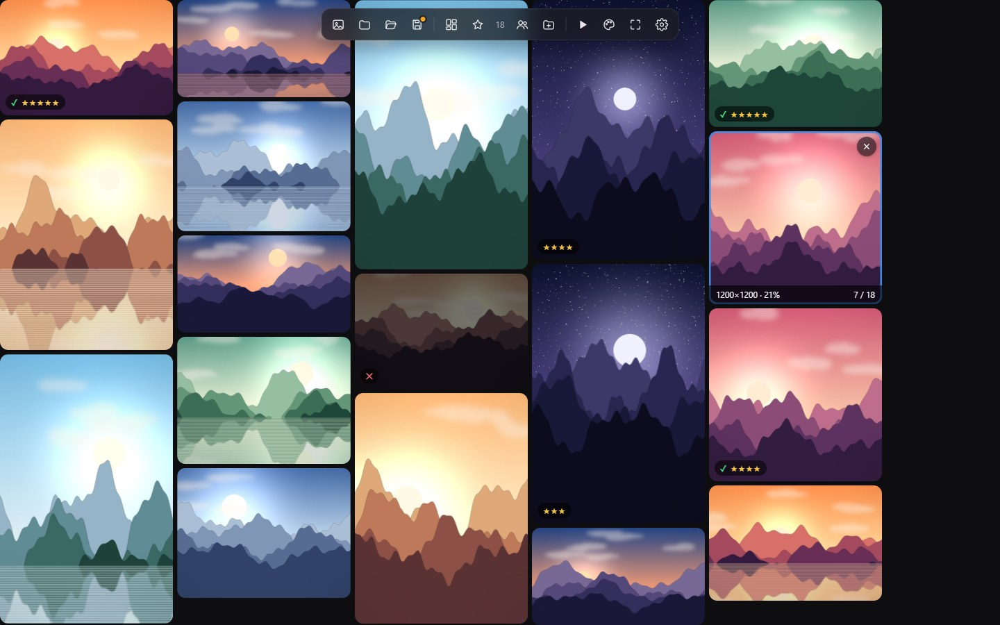
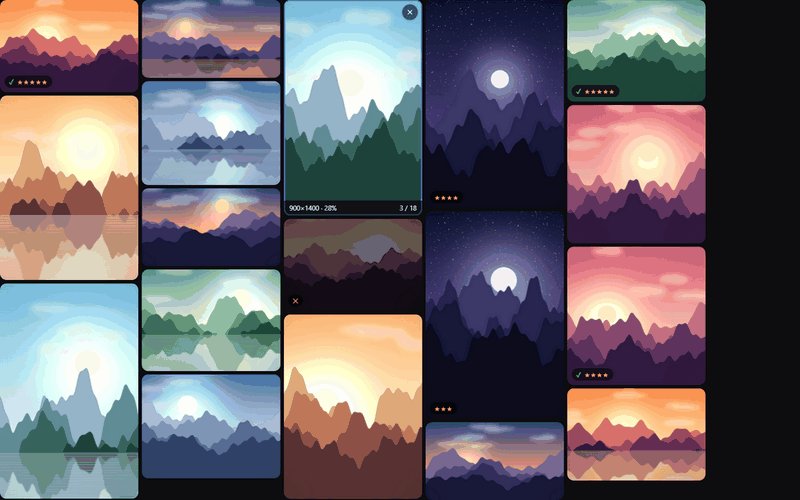
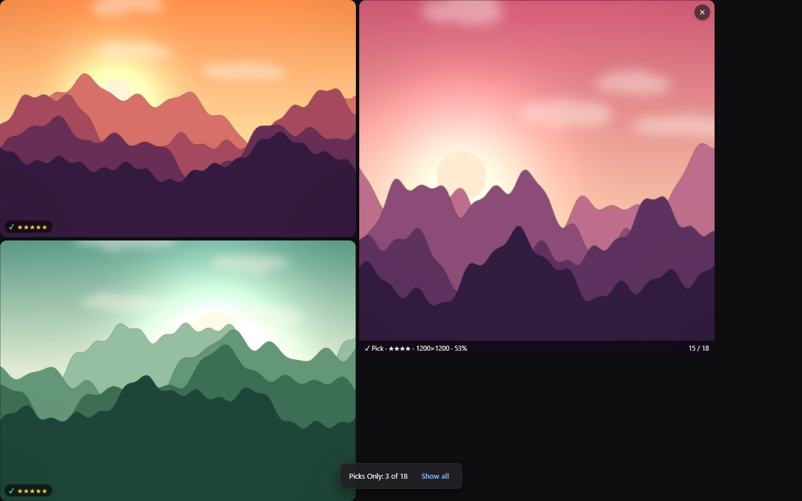
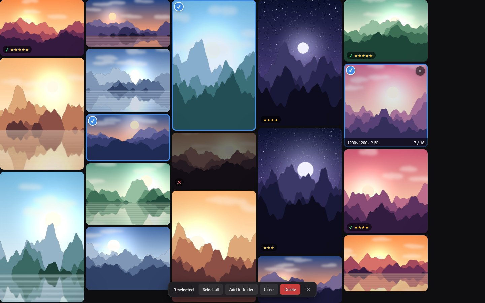
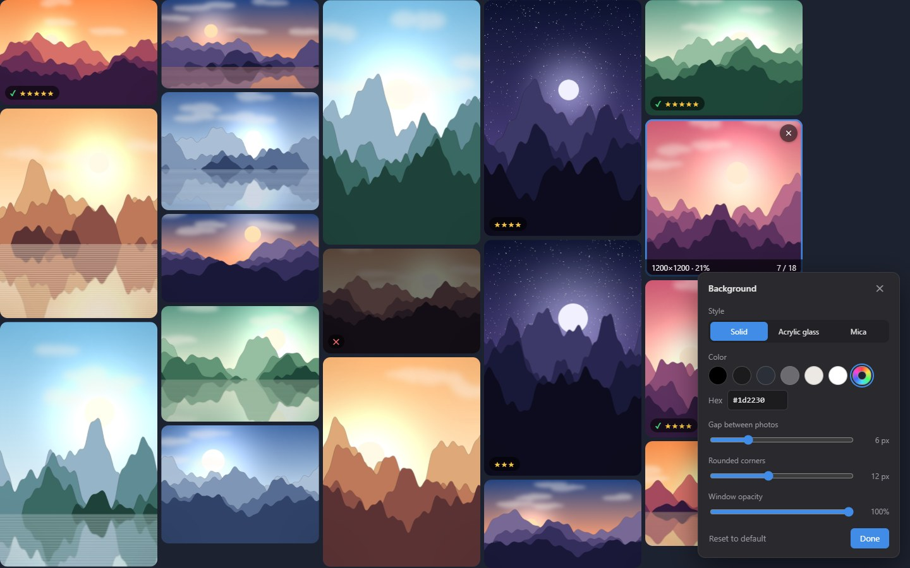
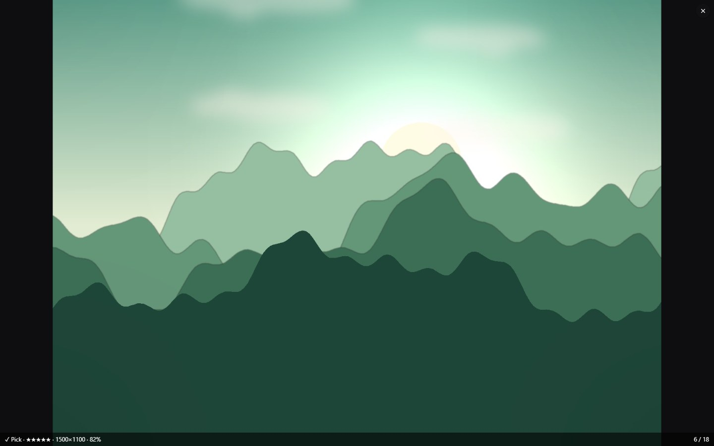

<div align="center">


# GridPhoto

**See every photo at once.**<br>
A fast, elegant desktop viewer that lays out a whole folder of photos in one window,
every photo fully visible, so you can compare them, cull them and present them.

[](#-download)
[](https://www.electronjs.org/)
[](LICENSE)
[](../../releases)
[](#%EF%B8%8F-your-photos-are-safe)
[](#-privacy)

[**Download**](#-download) · [**Features**](#-features) · [**Shortcuts**](#%EF%B8%8F-keyboard-shortcuts) · [**FAQ**](#-faq) · [**Build from source**](#-build-from-source)

<br>



</div>

<br>

## Why GridPhoto?

Most photo viewers show **one photo at a time**. Contact sheets and thumbnail grids show many photos,
but they **crop** or **shrink** them into identical boxes. GridPhoto does neither: it arranges photos in a
**waterfall layout that always fits the window**, keeps every photo uncropped, and makes each photo as large
as the screen allows.

It's inspired by [GridPlayer](https://github.com/vzhd1701/gridplayer), which does the same for videos.

<div align="center">
  
  <br><sub><i>Close a photo and the grid reflows · <kbd>Ctrl</kbd>+<kbd>Z</kbd> brings it back · <kbd>Space</kbd> starts a slideshow with transitions</i></sub>
</div>

<br>

## ✨ Features

<table>
<tr>
<td width="50%" valign="top">

### 🧱 A waterfall that always fits
GridPhoto tries every column count and picks the one with the **biggest photos** that still fit the
window, with **no scrolling and no cropping**. It balances the columns, uses small gaps and rounded
corners, and glides photos into place when anything changes. Prefer equal cells? <kbd>Ctrl</kbd>+<kbd>L</kbd>
switches to a classic grid.

</td>
<td width="50%" valign="top">

### ▶️ Present with one key
Hover a photo and press **<kbd>Space</kbd>**. It fills the screen and plays a slideshow through its folder
with your choice of **11 transitions**: crossfade, slide, cover, reveal, zoom, wipe, circle, blur, 3D flip
and more. An optional **Ken Burns** effect slowly pans and zooms. <kbd>Esc</kbd> returns to the grid.

</td>
</tr>
<tr>
<td valign="top">



### ⭐ Cull like a pro
Rate with **<kbd>1</kbd>–<kbd>5</kbd>**, **pick** with <kbd>P</kbd> and **reject** with <kbd>X</kbd>, the
same keys as Lightroom. Rejected photos dim out. Filter to *picks*, *★★★ and up* or *hide rejected*,
sort by rating, then **Save Picks** to a folder in one click.

</td>
<td valign="top">



### ☑️ Select, sort and clean up
<kbd>Ctrl</kbd>+<kbd>A</kbd> selects everything, <kbd>Ctrl</kbd>+click and <kbd>Shift</kbd>+click pick exactly the photos you
want. Rate, flag, rotate, add to a folder or delete them **all at once** from the selection bar.

</td>
</tr>
<tr>
<td valign="top">



### 🎨 Make it yours
Solid preset colours, any custom colour, or Windows 11 **Acrylic glass** and **Mica**, which let the
desktop show softly through. Live sliders adjust the gap between photos, the rounded corners and the
**window opacity** (handy for reference boards).

</td>
<td valign="top">



### 🔍 Inspect every detail
Zoom at the cursor, pan, view at 100%, or turn on **Sync View** (<kbd>Ctrl</kbd>+<kbd>Y</kbd>) to zoom and pan
**every photo together** and compare the same detail across all of them. Photos always open showing the
whole picture.

</td>
</tr>
<tr>
<td colspan="2" valign="top">

### 🧑‍🤝‍🧑 People & Folders: face recognition that stays on your PC
Click the **people** button in the toolbar (<kbd>Ctrl</kbd>+<kbd>Shift</kbd>+<kbd>F</kbd>). GridPhoto finds every face,
recognises who is who, and groups your photos into **one folder per person** in the People & Folders panel.
Open a person to see only their photos, rename them, or drag one person onto another to merge.

- **Tiny but accurate model.** [face-api](https://github.com/vladmandic/face-api) uses SSD-MobileNet detection,
  68-point alignment and 128-d face descriptors (99.4% on the LFW benchmark), about **12 MB** in total.
- **Downloaded once, on first use**, into a `models` folder next to the app, and verified with SHA-256.
- **Runs in the background** with a progress bar and time estimate. Rescans are instant thanks to a local cache.

**Sorted your people yourself?** **New folder** (<kbd>Ctrl</kbd>+<kbd>Shift</kbd>+<kbd>N</kbd>) makes your own folders: drag photos
onto them, or right-click → *Add to Folder*. **Import…** turns a directory you've already organised
(`People\Mom`, `People\John`, …) into folders in one go. Your folders also **teach the recognition**: a person who
appears in most of a folder's photos is named after it. **Export…** writes everything out as real folders on disk.

</td>
</tr>
</table>

### And the rest

| | |
|---|---|
| 🖼️ **Every cell browses its folder** | <kbd>←</kbd> <kbd>→</kbd> steps one photo through its folder; <kbd>Shift</kbd>+<kbd>←</kbd> <kbd>→</kbd> steps **all of them at once** |
| 🗂️ **Save & open grids** | **Save grid** / **Open grid** in the toolbar store the whole layout (photos, order, rotation, ratings, snapshots) as a JSON file (`.gphl` or `.json`). Your last session also reopens automatically |
| ✂️ **Non-destructive edits** | Rotate, flip and crop per photo, applied only when you export |
| 💾 **Export** | Save Photo As (remembers your folder), Save All, Save Picks, save the visible area at full resolution, grid screenshot, copy to clipboard |
| 🧰 **Floating toolbar** | Appears when you move the mouse to the top edge and stays out of the way otherwise |
| 🖥️ **Window** | Fullscreen, stay on top, window opacity, one instance (files open in the running window) |
| ⌨️ **Keyboard-first** | Every command has a shortcut, and every shortcut can be remapped in Settings |
| 🎞️ **Formats** | JPG · PNG · WebP · AVIF · GIF / APNG / animated WebP · BMP · ICO · SVG, with EXIF orientation |

<br>

## 🛡️ Your photos are safe

GridPhoto **never modifies, renames or deletes your original files.**

When you add photos, from a folder, drag & drop, paste, a saved grid or anywhere else, GridPhoto **copies them into
its own library**: an `images` folder next to the app (or the app's data folder if that location is read-only).
From then on the app works only with those copies. It doesn't keep a link to the originals.

| You do this | What happens |
|---|---|
| **Close** a photo (hover → **×**, <kbd>Ctrl</kbd>+<kbd>W</kbd>, or *Close* in the selection bar) | The photo leaves the grid and **GridPhoto's copy is deleted**. Changed your mind? <kbd>Ctrl</kbd>+<kbd>Z</kbd> or **Undo** brings it back until you quit |
| **Delete** (<kbd>Delete</kbd> key) | Asks first, then deletes GridPhoto's copy right away |
| **Rename** (<kbd>F2</kbd>) | Renames GridPhoto's copy |
| **Close All** | Clears the grid; copies stay in the library |

As a safety net, the app itself **refuses to delete or rename any file outside its library**. Open the library
any time from **Settings → Files**.

<br>

## 📥 Download

Get the latest build from the [**Releases**](../../releases/latest) page:

| File | What it is |
|---|---|
| `GridPhoto Setup 2.7.0.exe` | Installer (Start menu, file association for `.gphl`) |
| `GridPhoto 2.7.0.exe` | Portable, runs without installing |

> [!NOTE]
> The builds are not code-signed yet, so Windows SmartScreen may show a warning the first time.
> Choose **More info → Run anyway**.

<br>

## 🚀 Quick start

1. Drag a folder or some photos onto the window, or click **Open folder**.
2. **Hover** a photo and press **<kbd>Space</kbd>** for a fullscreen slideshow. <kbd>Esc</kbd> returns to the grid.
3. Rate as you go with <kbd>1</kbd>–<kbd>5</kbd>, <kbd>P</kbd> and <kbd>X</kbd>. Close photos you don't want with **×**.
4. Use **★ in the toolbar → Save Picks To Folder** to export the keepers.
5. Right-click anywhere for every option. <kbd>F1</kbd> lists all shortcuts.

<br>

## ⌨️ Keyboard shortcuts

Shortcuts act on the photo **under the mouse**, or on **all selected photos**.

| Viewing | | Culling & selection | |
|---|---|---|---|
| Enlarge & slideshow | <kbd>Space</kbd> | Rate ★ – ★★★★★ / clear | <kbd>1</kbd>–<kbd>5</kbd> / <kbd>0</kbd> |
| Back to the grid / clear selection | <kbd>Esc</kbd> | Pick / Reject / Unflag | <kbd>P</kbd> / <kbd>X</kbd> / <kbd>U</kbd> |
| Previous / next photo (all: + <kbd>Shift</kbd>) | <kbd>←</kbd> <kbd>→</kbd> | Select all | <kbd>Ctrl</kbd>+<kbd>A</kbd> |
| Single view on / off | <kbd>Enter</kbd> or double-click | Toggle / range select | <kbd>Ctrl</kbd>+click / <kbd>Shift</kbd>+click |
| Zoom in / out / reset | <kbd>=</kbd> <kbd>-</kbd> <kbd>Backspace</kbd> | Close photo (deletes copy) / undo | <kbd>Ctrl</kbd>+<kbd>W</kbd> / <kbd>Ctrl</kbd>+<kbd>Z</kbd> |
| Sync zoom & pan | <kbd>Ctrl</kbd>+<kbd>Y</kbd> | Delete (asks first) | <kbd>Delete</kbd> |
| Rotate | <kbd>[</kbd> <kbd>]</kbd> | Save picks | <kbd>Ctrl</kbd>+<kbd>Shift</kbd>+<kbd>P</kbd> |
| Waterfall ↔ grid | <kbd>Ctrl</kbd>+<kbd>L</kbd> | Save photo as | <kbd>Ctrl</kbd>+<kbd>Alt</kbd>+<kbd>S</kbd> |

| Files & grids | | People, folders & window | |
|---|---|---|---|
| Add photos / add folder | <kbd>Ctrl</kbd>+<kbd>N</kbd> / <kbd>Ctrl</kbd>+<kbd>Shift</kbd>+<kbd>A</kbd> | Find people | <kbd>Ctrl</kbd>+<kbd>Shift</kbd>+<kbd>F</kbd> |
| Open grid / save grid | <kbd>Ctrl</kbd>+<kbd>O</kbd> / <kbd>Ctrl</kbd>+<kbd>S</kbd> | People & Folders panel | <kbd>Ctrl</kbd>+<kbd>Shift</kbd>+<kbd>E</kbd> |
| Paste photos | <kbd>Ctrl</kbd>+<kbd>V</kbd> | New folder | <kbd>Ctrl</kbd>+<kbd>Shift</kbd>+<kbd>N</kbd> |
| Rename | <kbd>F2</kbd> | Background panel | <kbd>Ctrl</kbd>+<kbd>B</kbd> |
| Slideshow speed | <kbd>,</kbd> <kbd>.</kbd> | Fullscreen | <kbd>F</kbd> / <kbd>F11</kbd> |
| Cycle transition | <kbd>T</kbd> / <kbd>Shift</kbd>+<kbd>T</kbd> | Settings | <kbd>F6</kbd> |

<details>
<summary><b>Mouse</b></summary>

| Action | Mouse |
|---|---|
| Zoom at cursor | Wheel (<kbd>Ctrl</kbd>+wheel browses the folder) |
| Pan a zoomed photo | Left-drag (or middle-drag) |
| Swap two photos | Drag one onto another (<kbd>Alt</kbd>+drag when zoomed) |
| Add a photo to a folder | Drag it onto the folder in the People & Folders panel |
| Replace a photo | <kbd>Ctrl</kbd>+drop a file onto it |
| Close a photo | Hover → **×** in the top-right corner |
| Everything else | Right-click |

</details>

<br>

## ❓ FAQ

<details>
<summary><b>Where are my photos stored?</b></summary>

In GridPhoto's library: an `images` folder next to `GridPhoto.exe` (for the installer, usually
`%LOCALAPPDATA%\Programs\GridPhoto\images`; for the portable version, next to the `.exe`). Photos are grouped by the
name of the folder they came from. **Settings → Files → Open** takes you there.

</details>

<details>
<summary><b>Will deleting or closing a photo delete my original?</b></summary>

No. Close and Delete only remove GridPhoto's copy, and the app refuses to touch files outside its library.

</details>

<details>
<summary><b>How do I free up disk space?</b></summary>

The library uses as much space as the photos you add. Closing or deleting a photo removes its copy (closed photos are
removed for good when you quit, so Undo keeps working until then). Uninstalling leaves the `images` and `models`
folders in place, so delete them by hand if you no longer need them.

</details>

<details>
<summary><b>Why won't my HEIC or TIFF photos open?</b></summary>

GridPhoto uses Chromium's image decoders, which don't support HEIC or TIFF. Convert them to JPG first, or use the
original Python prototype in [`legacy/python`](legacy/python), which can open both.

</details>

<details>
<summary><b>Does face recognition upload anything?</b></summary>

No. The model is downloaded once (after you confirm) and then everything runs on your computer. See [Privacy](#-privacy).

</details>

<br>

## 🛠 Build from source

Requires [Node.js](https://nodejs.org/) 20 or newer. Install the dependencies:

```bash
npm install
```

Run the app (optionally pass photos, folders or a `.gphl` file):

```bash
npm start
```

Build the Windows installer and portable exe into `dist/`:

```bash
npm run dist
```

Check the code with ESLint:

```bash
npm run lint
```

<details>
<summary><b>Project structure</b></summary>

```
electron/
  main.js         main process: window, photo library, files, dialogs, clipboard, glass, menus
  preload.js      the small, explicit API exposed to the page (context isolation + sandbox)
  faces.js        face model download + SHA-256 check, background worker, cache, clustering
  face-preload.js bridge for the hidden face worker window
src/
  index.html      shell, toolbar, selection bar, welcome screen
  styles.css
  js/
    app.js        app controller: grid state, menus, shortcuts, selection, ratings, library, sessions
    cell.js       one photo: canvas rendering, zoom/pan/rotate/crop, overlay, slideshow
    layout.js     waterfall (masonry) and equal-cell grid algorithms
    transitions.js  slideshow transitions (Web Animations API)
    commands.js   every command and its default shortcut
    people.js     People & Folders: face recognition UI, user folders, import/export
    ui.js         dialogs, settings & shortcut editor, background panel, toasts
    imageload.js  off-thread decoding (createImageBitmap / ImageDecoder)
  face/           hidden worker window that runs the face model (TensorFlow.js, WebGL)
legacy/python/    the original PyQt6 prototype (opens HEIC & TIFF)
```

</details>

<br>

## 🔒 Privacy

GridPhoto collects **no telemetry** and **never uploads your photos**. Its only network request is the one-time
download of the face recognition model (about 12 MB from cdn.jsdelivr.net), which happens only when you first click
**Find people**, and only after you confirm. Face data stays in the app's local data folder.

## 🙏 Acknowledgements

- [GridPlayer](https://github.com/vzhd1701/gridplayer) by vzhd1701, the inspiration for the grid-of-media idea and many shortcuts
- [face-api](https://github.com/vladmandic/face-api) by Vladimir Mandic (MIT), face detection & recognition
- [exifr](https://github.com/MikeKovarik/exifr) for EXIF metadata
- [Electron](https://www.electronjs.org/)

## 📄 License

[MIT](LICENSE). Free for personal and commercial use.

<div align="center">
<br>
<sub>The sample photos in the screenshots are procedurally generated.</sub>
</div>
